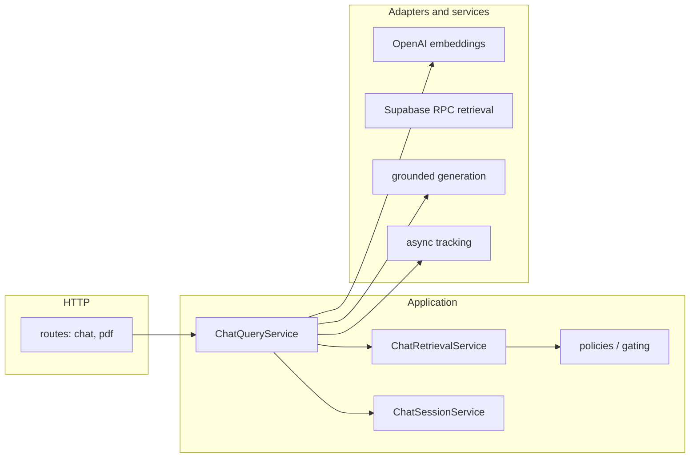

# PDF Knowledge Chatbot

Backend-only [FastAPI](https://fastapi.tiangolo.com/) service that answers questions with **retrieval-augmented generation (RAG)** over PDF chunks stored in **Supabase**. Embeddings and chunk text live in an Assessment-owned `pdf_embeddings` table; this service adds chat orchestration, session handling, relevance gating, and chatbot-owned persistence.

## What this service does

- Exposes JSON HTTP APIs for **chat**, **sessions**, **health**, and **read-only PDF presence** metadata.
- Embeds the user query with **OpenAI**, calls the Postgres RPC **`match_pdf_embeddings(vector(1536), int)`**, applies **relevance and evidence gating**, then performs a **single grounded LLM** completion when context is strong enough.
- Persists query/chat telemetry and conversation turns in **chatbot-specific** tables (`chatbot_*`).
- Does **not** implement the primary PDF upload or deletion pipeline (Assessment owns ingestion); upload/delete-style routes return **501** where applicable but may remain for contract compatibility.

## High-level architecture



**Composition:** `app/main.py` loads the app from `app.core.app_factory.create_app()`. HTTP lives under `app/routes/`. Use-case flow is in `app/application/chat/` (orchestration, policies, retrieval coordination). Infrastructure is wired through `app/application/chat/dependencies.py` into adapters under `app/services/adapters/`, `app/services/generation/`, and related packages.

### Typical chat request path

1. Client calls **`POST /chat/query`** with a **`ChatQueryPayload`** body (`request.query`, optional `user_id`, `conversation_id`, etc.).
2. `ChatQueryService` resolves **session** context (in-memory session service + optional Supabase profile/history).
3. **Embedding** is generated for the query (dimensions must match **`1536`** and the `pdf_embeddings` column).
4. **Retrieval** uses `public.match_pdf_embeddings` over Assessment **`pdf_embeddings`**.
5. **Gating** (`app/application/chat/policies.py`) decides if evidence is strong enough; otherwise the API returns the fixed **PDF-only refusal** string (see below).
6. If accepted, **one** grounded generation call produces the answer; **sources** are derived from accepted chunks.
7. **Tracking** and history persistence run asynchronously where configured.

## Project layout

```text
vimeo_video_chatbot/
├── api/
│   └── index.py              # Vercel entry: imports app.main:app
├── app/
│   ├── main.py               # FastAPI app export
│   ├── core/
│   │   ├── app_factory.py    # App, middleware, health, routers, exception handlers
│   │   ├── exceptions.py
│   │   ├── middleware.py
│   │   └── request_context.py
│   ├── routes/
│   │   ├── chat.py           # Chat + session HTTP API
│   │   └── pdf_ingest.py     # PDF list / metadata (read-oriented)
│   ├── application/
│   │   ├── chat/             # query_service, policies, retrieval_service, session_service, …
│   │   └── ports/            # EmbeddingsPort, RetrievalPort, TrackingPort, …
│   ├── config/
│   │   └── settings.py       # Pydantic settings + .env loading
│   ├── database/
│   │   ├── migrations.sql    # chatbot_* tables + match_pdf_embeddings RPC
│   │   └── supabase.py
│   ├── models/
│   │   └── schemas.py        # ChatRequest, ChatQueryPayload, ChatResponse, …
│   ├── services/             # adapters, generation, pdf, persistence, text; vector_store, …
│   └── utils/
├── scripts/
│   └── auto_update_embeddings.py
├── tests/                    # pytest suite (see Testing)
├── requirements.txt
├── pytest.ini
├── vercel.json
└── README.md
```

### Files worth knowing

| Area | Location |
|------|----------|
| App bootstrap | `app/core/app_factory.py` |
| Chat HTTP routes | `app/routes/chat.py` |
| PDF HTTP routes | `app/routes/pdf_ingest.py` |
| Query orchestration | `app/application/chat/query_service.py` |
| RAG thresholds & refusal | `app/application/chat/policies.py` |
| Service wiring | `app/application/chat/dependencies.py` |
| Vector RPC + fallback | `app/services/vector_store.py` |
| Schema + RPC definition | `app/database/migrations.sql` |

## HTTP API

### Service root and health

| Method | Path | Notes |
|--------|------|--------|
| GET | `/` | JSON: `{"message": "Backend is running"}` |
| GET | `/health` | Liveness / environment metadata |
| GET | `/ops/health/database` | DB connectivity check; may return **503** when degraded |

**Compatibility (same app, often omitted from OpenAPI):** `GET /api/v1/health`, `GET /api/v1/ops/health/database`, and `GET /health/database` (alias of ops DB health) remain registered for existing clients.

**OpenAPI / Swagger:** In **`ENVIRONMENT=production`**, `/docs`, `/redoc`, and `/openapi.json` are disabled. In development they are enabled.

### Chat

**Primary documented contract (OpenAPI):**

| Method | Path | Purpose |
|--------|------|---------|
| POST | `/chat/query` | Submit a query; returns `ChatResponse` |
| POST | `/chat/sessions` | Create a server-managed session |
| DELETE | `/chat/sessions/{session_id}` | End session |
| GET | `/chat/sessions/{session_id}/history` | Persisted turns for a session |

**Still registered, same behavior; hidden from OpenAPI** to reduce duplicate documentation:

- `POST /chat/queries` — same handler as `/chat/query`.
- Session/memory/user helpers under `/chat/users/...`, `DELETE /chat/sessions/{session_id}/memory`, and **legacy path aliases** such as `/chat/session/create`, `/chat/history/{session_id}`, etc.

**Versioned mirrors:** The same routers are mounted under **`/api/v1/chat/...`** for backward compatibility; those paths are **hidden from OpenAPI** via router registration flags.

### PDF

Assessment owns ingestion. This API focuses on **listing and inspecting** presence in the embedding store.

**Documented in OpenAPI:**

| Method | Path | Purpose |
|--------|------|---------|
| GET | `/pdf` | List PDF documents known to the embedding layer |
| GET | `/pdf/{pdf_id}` | Presence / embedding count–style metadata |

**Registered but typically omitted from OpenAPI:** `POST /pdf`, `POST /pdf/batch`, `DELETE /pdf/{pdf_id}` (return **501**), `GET /pdf/{pdf_id}/status` (overlaps conceptually with `GET /pdf/{pdf_id}`), and legacy aliases **`/pdf/upload`**, **`/pdf/upload/batch`**, **`/pdf/list`**.

**Versioned mirrors:** `/api/v1/pdf/...` matches the same router; hidden from OpenAPI.

### Request and response shapes

**Chat request** (envelope):

```json
{
  "request": {
    "query": "What is covered in chapter 2?",
    "user_id": "optional-user-id",
    "conversation_id": "optional-session-id",
    "max_tokens": 1000,
    "temperature": 0.0,
    "top_k": 3,
    "include_sources": true
  }
}
```

**Chat response** (abridged):

```json
{
  "answer": "…",
  "sources": [
    {
      "source_type": "pdf",
      "pdf_title": "…",
      "pdf_id": "…",
      "page_number": 1,
      "chunk_id": 1,
      "relevance_score": 0.62,
      "source_name": "…"
    }
  ],
  "conversation_id": "session-id",
  "processing_time": 1.23,
  "tokens_used": null
}
```

Validation and API errors use a **standard JSON envelope** (`code`, `message`, `details`, `timestamp`, `path`, `method`) from the global exception handlers in `app_factory`.

## RAG behavior and policies

Constants and rules live in **`app/application/chat/policies.py`**, including:

- `RAG_HIGH_CONFIDENCE_SCORE` (default **0.45**)
- `RAG_MIN_RELEVANCE_THRESHOLD` (default **0.25**)
- `RAG_MIN_CONTEXT_CHARS` (default **80**)
- `RAG_MIN_SUPPORTING_CHUNKS` (default **2**)
- Stricter effective thresholds when retrieval uses a **degraded fallback** path (see `resolve_thresholds` in the same module).

**Canonical refusal** when evidence is insufficient:

```text
Sorry, I can only answer questions related to the available PDF study materials.
```

Short **greetings** may be answered without retrieval (see `GREETING_RESPONSES` in `policies.py`).

## Database

### Assessment-owned (read-only from this service)

- Data is read from **`public.pdf_embeddings`** (and related Assessment tables as present in your project). This repo’s migration **does not** create `pdf_embeddings`.

### Chatbot-owned (created in `migrations.sql`)

- `chatbot_user_queries`
- `chatbot_chat_history`
- `chatbot_user_profile`

### RPC

- **`public.match_pdf_embeddings(vector(1536), int)`** — defined in `app/database/migrations.sql`; maps Assessment columns (`chunk_text`, `chunk_index`, etc.) to the shape expected by the Python retrieval layer.

Run the SQL in the Supabase SQL editor (or your migration process) **after** Assessment tables and `pdf_embeddings` exist.

## Configuration

Required for full operation:

```env
OPENAI_API_KEY=sk-…
SUPABASE_URL=https://your-project.supabase.co
SUPABASE_SERVICE_KEY=your-service-role-key
```

Common optional settings (see **`app/config/settings.py`**):

```env
ENVIRONMENT=development
EMBEDDING_MODEL=text-embedding-3-small
EMBEDDING_DIMENSIONS=1536
LLM_MODEL=gpt-3.5-turbo
ALLOWED_ORIGINS=http://localhost:3000,http://127.0.0.1:3000
SUPABASE_TABLE=pdf_embeddings
RATE_LIMIT_PER_MINUTE=60
```

`ENVIRONMENT` must be one of `development`, `staging`, `production`. Use **`production`** to hide interactive API docs.

## Local development

```bash
python -m venv .venv
.venv\Scripts\activate
pip install -r requirements.txt
```

Create a **`.env`** file in the project root (loaded automatically via `pydantic-settings` / `python-dotenv`).

Run the API:

```bash
python -m uvicorn app.main:app --host 127.0.0.1 --port 8000 --reload
```

Useful URLs in development:

- `http://127.0.0.1:8000/` — service root
- `http://127.0.0.1:8000/health`
- `http://127.0.0.1:8000/docs` — Swagger UI

## Testing

Automated tests live under **`tests/`** and are run with **pytest**:

```bash
python -m pytest tests/ -q
```

Notable areas:

- `tests/api/` — HTTP chat routes
- `tests/application/chat/` — query service behavior
- `tests/services/` — vector store, stores, user profile
- `tests/test_app_factory_errors.py` — global error envelopes and health
- `tests/test_openapi_surface.py` — OpenAPI shape expectations

## Deployment (Vercel)

- **`vercel.json`** builds **`api/index.py`** with **`@vercel/python`** and routes all traffic to that function.
- **`api/index.py`** adds the repo root to `sys.path` and imports **`app.main:app`**.
- **`includeFiles`** bundles `app/**` and `requirements.txt`; keep function size under Vercel limits.

Confirm the runtime uses a compatible Python version with your pinned dependencies.

## Troubleshooting

| Symptom | Checks |
|---------|--------|
| Import / cold-start failures | Vercel logs from `api/index.py`; local `python -c "from app.main import app"` |
| DB health failing | `SUPABASE_URL`, `SUPABASE_SERVICE_KEY`, chatbot tables applied, RPC present |
| Everything refuses | Rows in `pdf_embeddings`, **1536-dim** embeddings, RPC `match_pdf_embeddings`, logs for similarity and fallback |
| OpenAI errors | Key validity, quota, model names in settings |

## Limitations

- No first-party **authentication** layer on the API in this repository.
- PDF **upload/delete** are not implemented here (Assessment pipeline); some routes return **501** by design.
- Optimized for **PDF-grounded** Q&A, not open-domain chat.
- **CORS** and **rate limiting** behavior depend on `app/core/app_factory.py` and `app/core/middleware.py` configuration.

## License

This project is licensed under the **MIT License** unless the repository specifies otherwise.
